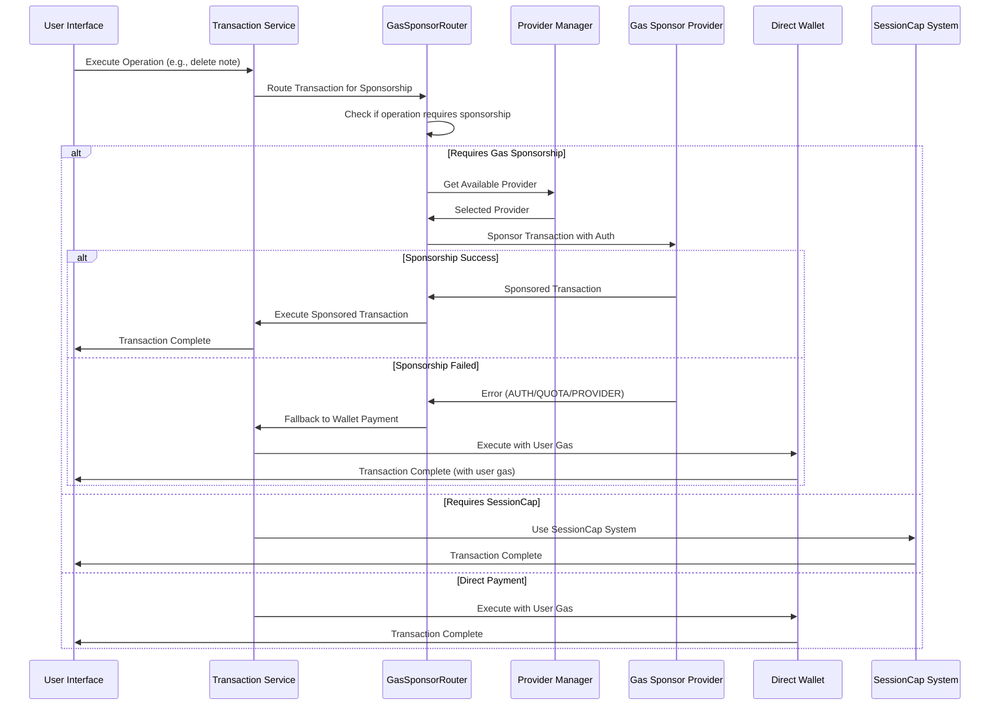

# Gas Sponsorship Provider System - Technical Design

## Technical Overview

### Architecture Approach
The gas sponsorship system implements a **provider abstraction layer** that enables pluggable gas fee sponsorship while maintaining separation from the existing SessionCap system. The design follows a **simple interface-first approach** with minimal complexity, focusing on practical implementation rather than over-engineering.

### Technology Stack Justification
**Chosen Stack**: TypeScript/JavaScript (TypeScript + React + Existing Sui SDK)

**Rationale**:
- **Consistency**: Leverages existing frontend technology stack and Sui SDK integration
- **Type Safety**: TypeScript interfaces provide compile-time validation for provider contracts
- **Zero Infrastructure**: No additional backend infrastructure required for the abstraction layer
- **Performance**: Client-side execution reduces latency for sponsorship decisions
- **Maintenance**: Single technology stack reduces operational complexity

### Key Design Decisions
1. **Simple Authentication Interface**: `AuthInfo` with flexible token-based authentication
2. **Provider-Independent**: Each provider handles its own authentication logic
3. **Graceful Degradation**: Automatic fallback to wallet payment on sponsorship failure
4. **Configuration-Driven**: Environment variables + runtime settings for provider management
5. **Transaction Routing**: Clear separation between SessionCap and gas sponsorship transactions

## System Architecture

### High-Level Component Diagram

```
┌─────────────────────────────────────────────────────────────────┐
│                      Frontend Application                       │
├─────────────────────────────────────────────────────────────────┤
│  ┌─────────────┐  ┌──────────────┐  ┌─────────────────────────┐ │
│  │ Transaction │←→│GasSponsorRouter│←→│ Provider Manager       │ │
│  │   Service   │  │              │  │                         │ │
│  └─────────────┘  └──────────────┘  │ ┌─────────────────────┐ │ │
│                                │  │ │ GasSponsorProvider  │ │ │
│                                │  │ │    Interface        │ │ │
│                                │  │ └─────────────────────┘ │ │
│                                │           ▲                 │ │
│                                │           │                 │ │
│                                │  ┌───────┴───────┐         │ │
│                                │  │   Providers   │         │ │
│                                │  │ ┌─────────────┐ │         │ │
│                                │  │ │ EnokiProvider│ │         │ │
│                                │  │ │CustomBackend │ │         │ │
│                                │  │ │  Provider    │ │         │ │
│                                │  │ └─────────────┘ │         │ │
│                                │  └───────────────┘         │ │
│  ┌─────────────┐                │                           │ │
│  │SessionCap   │                │                           │ │
│  │   System    │ (Unchanged)    │                           │ │
│  │(WAL+GAS)    │────────────────┘                           │ │
│  └─────────────┘                                            │ │
└─────────────────────────────────────────────────────────────────┘
```

### Data Flow and Component Interactions

#### Transaction Sponsorship Flow


### Integration Points and Dependencies

#### Existing System Dependencies
- **SuiService**: Primary transaction service for SUI blockchain operations
- **SessionContext**: Manages SessionCap state and WAL storage operations
- **SettingsContext**: Provides configuration management for gas sponsorship
- **@mysten/dapp-kit**: Core SDK for SUI wallet integration and transaction building

#### External Provider Dependencies
- **Enoki Service**: OAuth-based gas sponsorship via Mysten Labs
- **Custom Backend API**: Invitation code validation and sponsorship service

## Data Design

### Interface Definitions

```typescript
// Core provider interface
interface GasSponsorProvider {
  id: string;
  name: string;
  type: 'enoki' | 'custom-backend';

  // Core sponsorship methods
  sponsorTransaction(tx: Transaction, authInfo?: AuthInfo): Promise<SponsoredTransaction>;
  isAvailable(): Promise<boolean>;
  estimateGas(tx: Transaction): Promise<GasEstimate>;

  // Configuration and status
  configure(config: ProviderConfig): Promise<void>;
  getStatus(): Promise<ProviderStatus>;
}

// Authentication information structure
interface AuthInfo {
  type: 'invitation' | 'oauth' | 'whitelist' | 'api-key';
  token: string;
  metadata?: Record<string, any>;
}

// Sponsored transaction result
interface SponsoredTransaction {
  sponsoredTx: Transaction;
  sponsorSignature: string;
  gasUsed: number;
  gasBudget: number;
  providerId: string;
}

// Provider configuration
interface ProviderConfig {
  enabled: boolean;
  priority: number;
  endpoint?: string;
  timeout: number;
  retryAttempts: number;
  customSettings?: Record<string, any>;
}

// Error classification
interface SponsorshipError extends Error {
  code: 'AUTHENTICATION_FAILED' | 'INSUFFICIENT_QUOTA' | 'INVALID_OPERATION' | 'PROVIDER_ERROR';
  message: string;
  providerId?: string;
  details?: any;
}
```

### Transaction Type Classification

```typescript
// Operations eligible for gas sponsorship
enum GasSponsoredOperation {
  DELETE_NOTE = 'delete_note',
  CREATE_FOLDER = 'create_folder',
  UPDATE_FOLDER = 'update_folder',
  DELETE_FOLDER = 'delete_folder',
  MOVE_NOTE = 'move_note',
  UPDATE_NOTE_METADATA = 'update_note_metadata'
}

// Transaction routing decision
interface TransactionRoute {
  paymentMethod: 'sessioncap' | 'gas-sponsor' | 'direct-wallet';
  providerId?: string;
  requiresAuth?: boolean;
  reason: string;
}
```

### Configuration Schema

```typescript
// Environment-based configuration
interface GasSponsorSystemConfig {
  providers: {
    [providerId: string]: {
      type: 'enoki' | 'custom-backend';
      enabled: boolean;
      priority: number;
      config: ProviderConfig;
    };
  };
  defaultProvider?: string;
  fallbackToWallet: boolean;
  enableCaching: boolean;
  cacheTimeout: number;
}

// Example configuration
const config: GasSponsorSystemConfig = {
  providers: {
    enoki: {
      type: 'enoki',
      enabled: true,
      priority: 1,
      config: {
        endpoint: 'https://api.enoki.mystenlabs.com',
        timeout: 10000,
        retryAttempts: 3
      }
    },
    custom: {
      type: 'custom-backend',
      enabled: true,
      priority: 2,
      config: {
        endpoint: process.env.VITE_GAS_SPONSOR_API,
        timeout: 8000,
        retryAttempts: 2
      }
    }
  },
  defaultProvider: 'enoki',
  fallbackToWallet: true,
  enableCaching: true,
  cacheTimeout: 30000
};
```

## API Design

### Provider Interface Methods

#### sponsorTransaction()
```typescript
/**
 * Sponsors a transaction using the provider's gas payment mechanism
 * @param tx - The transaction to sponsor
 * @param authInfo - Authentication information for the user
 * @returns Promise resolving to sponsored transaction details
 * @throws SponsorshipError with specific error codes
 */
sponsorTransaction(tx: Transaction, authInfo?: AuthInfo): Promise<SponsoredTransaction>;
```

#### isAvailable()
```typescript
/**
 * Checks if the provider is currently available for sponsoring transactions
 * @returns Promise resolving to availability status
 */
isAvailable(): Promise<boolean>;
```

#### estimateGas()
```typescript
/**
 * Estimates gas costs for a transaction through this provider
 * @param tx - Transaction to estimate gas for
 * @returns Promise resolving to gas estimation details
 */
estimateGas(tx: Transaction): Promise<GasEstimate>;
```

### Error Response Format

```typescript
// Standardized error response across providers
interface ErrorResponse {
  error: {
    code: string;
    message: string;
    providerId: string;
    timestamp: string;
    requestId?: string;
    details?: any;
  };
}

// Example error responses
{
  error: {
    code: "AUTHENTICATION_FAILED",
    message: "Invalid or expired invitation code",
    providerId: "custom-backend",
    timestamp: "2025-11-26T10:30:00Z",
    details: {
      remainingAttempts: 2,
      lockoutTime: "2025-11-26T10:35:00Z"
    }
  }
}
```

## Security Considerations

### Authentication Mechanisms

#### Token Security
- **Transport Security**: All API calls use HTTPS with certificate validation
- **Token Storage**: Authentication tokens never stored in localStorage, only in memory
- **Token Validation**: Providers implement their own token validation and refresh logic
- **Token Expiration**: Automatic handling of token expiration with user prompts

#### Invitation Code Security
- **Single-Use**: Invitation codes designed for one-time activation or limited usage
- **Code Format**: Cryptographically secure random generation (handled by external system)
- **Validation**: Server-side validation prevents client-side manipulation
- **Rate Limiting**: Failed attempts tracked to prevent brute force attacks

### Data Protection and Encryption

#### Sensitive Data Handling
- **API Keys**: Provider API keys stored in environment variables, never client-side
- **User Data**: No personal user information transmitted beyond necessary authentication
- **Transaction Data**: Only transaction bytes and minimal metadata sent to providers
- **Logging**: Sensitive information redacted from logs and error messages

#### Privacy Protection
- **Minimal Data Collection**: Only essential authentication data collected
- **Data Retention**: No long-term storage of user authentication data
- **Third-party Privacy**: Each provider's privacy policy respected and communicated
- **User Consent**: Clear indication when external services are used for sponsorship

### Input Validation and Sanitization

#### Transaction Validation
- **Transaction Format**: Validate BCS-encoded transaction structure
- **Operation Types**: Only allow predefined operation types for sponsorship
- **Gas Limits**: Enforce maximum gas budgets to prevent abuse
- **Recipients**: Validate transaction recipients against allowed contract addresses

#### Authentication Validation
- **Token Format**: Strict validation of token formats per provider requirements
- **Metadata Sanitization**: Remove any sensitive information from metadata
- **Input Length**: Enforce reasonable limits on authentication input lengths
- **Character Encoding**: Proper UTF-8 encoding validation for all inputs

### Access Control and Permissions

#### Operation Permissions
- **Operation Whitelist**: Only specific operations eligible for sponsorship
- **User Eligibility**: Provider-specific eligibility validation
- **Usage Limits**: Enforce per-user transaction limits and quotas
- **Time-based Restrictions**: Implement rate limiting per time windows

#### Provider Access Control
- **Provider Configuration**: Only admin-level changes to provider settings
- **Endpoint Security**: Provider API endpoints protected with proper authentication
- **Network Restrictions**: Provider communications limited to required endpoints
- **Fail-Safe Default**: Configuration errors result in provider being disabled

## Performance & Scalability

### Performance Targets and Bottlenecks

#### Latency Requirements
- **Sponsorship Decision**: < 100ms for provider selection and routing
- **Provider API Calls**: < 2s for successful sponsorship requests
- **Fallback Trigger**: < 500ms to trigger wallet payment fallback
- **UI Responsiveness**: No blocking UI operations during sponsorship

#### Throughput Considerations
- **Concurrent Requests**: Support for multiple simultaneous sponsorship requests
- **Provider Pooling**: Efficient connection reuse to provider endpoints
- **Request Queuing**: Implement request queuing during provider unavailability
- **Caching Strategy**: Provider availability and capability caching

### Caching Strategies

#### Provider Status Caching
```typescript
interface ProviderCache {
  providerId: string;
  status: 'available' | 'unavailable' | 'error';
  lastChecked: number;
  cacheExpiry: number;
  errorCount: number;
}

// Cache provider availability for 30 seconds
const CACHE_DURATION = 30000;
```

#### Configuration Caching
- **Static Configuration**: Cache provider configuration after initial load
- **Runtime Settings**: Cache user preferences with immediate updates on changes
- **Network Conditions**: Cache network status to avoid repeated connectivity checks
- **Authentication State**: Cache authentication status with proper invalidation

### Database Optimization (for Custom Backend)

#### Query Optimization
- **Indexed Queries**: Proper indexing on user address and invitation code fields
- **Connection Pooling**: Efficient database connection management
- **Query Batching**: Batch multiple requests where possible
- **Read Replicas**: Use read replicas for availability checks and statistics

#### Data Modeling
- **Normalization**: Proper normalization to avoid data redundancy
- **Partitioning**: Time-based partitioning for usage statistics
- **Archival Strategy**: Archive old usage data to maintain query performance
- **Cleanup Jobs**: Regular cleanup of expired sessions and tokens

### Scaling Considerations

#### Horizontal Scaling
- **Stateless Design**: Provider instances designed to be stateless
- **Load Balancing**: Multiple provider instances behind load balancers
- **Geographic Distribution**: Provider endpoints in multiple regions
- **Graceful Degradation**: System functionality maintained during partial failures

#### Resource Management
- **Memory Management**: Proper cleanup of authentication tokens and temporary data
- **Connection Limits**: Implement connection pooling and limits
- **Timeout Management**: Configurable timeouts for all external calls
- **Resource Monitoring**: Monitor and alert on resource usage patterns

## Implementation Approach

### Development Phases and Priorities

#### Phase 1: Core Infrastructure (Week 1-2)
1. **Interface Definition**: Define `GasSponsorProvider` interface and base types
2. **Transaction Router**: Implement transaction routing logic
3. **Provider Manager**: Create provider management and selection system
4. **Configuration System**: Implement environment-based configuration
5. **Error Handling**: Establish standardized error handling and fallback logic

#### Phase 2: Provider Implementation (Week 3-4) - Parallel Development
1. **Custom Backend Provider**: Implement invitation code authentication
2. **Enoki Provider**: Implement OAuth-based authentication
3. **Testing Infrastructure**: Create comprehensive testing framework
4. **Mock Providers**: Implement mock providers for testing
5. **Integration Tests**: End-to-end testing with both providers

#### Phase 3: Frontend Integration (Week 5)
1. **Service Integration**: Integrate with existing SuiService
2. **UI Components**: Add gas sponsorship status indicators
3. **Settings Integration**: Add provider configuration to settings
4. **Error Handling UI**: Implement user-friendly error messages
5. **Transaction Flow**: Integrate sponsorship into existing transaction flows

#### Phase 4: Testing and Optimization (Week 6)
1. **Performance Testing**: Load testing and optimization
2. **Security Testing**: Security audit and penetration testing
3. **User Testing**: User experience testing and feedback
4. **Documentation**: Comprehensive documentation and deployment guides
5. **Production Deployment**: Production deployment and monitoring setup

### Testing Strategy Alignment

#### Unit Testing
- **Interface Compliance**: Test all provider implementations against interface
- **Error Scenarios**: Comprehensive testing of all error conditions
- **Configuration Testing**: Test configuration validation and loading
- **Authentication Testing**: Test various authentication scenarios

#### Integration Testing
- **Provider Communication**: Test communication with actual provider endpoints
- **Transaction Flow**: Test complete transaction flows with sponsorship
- **Fallback Mechanisms**: Test fallback to wallet payment
- **Performance Testing**: Test performance under various load conditions

#### End-to-End Testing
- **User Scenarios**: Test complete user journeys
- **Error Recovery**: Test error recovery and user guidance
- **Cross-browser Testing**: Test across different browsers and devices
- **Network Conditions**: Test under various network conditions

### Deployment and Rollout Plan

#### Feature Flags
- **Provider Toggles**: Individual provider enable/disable via feature flags
- **Gradual Rollout**: Gradual rollout by user segments
- **Emergency Disable**: Ability to disable sponsorship system entirely
- **Monitoring Integration**: Real-time monitoring of sponsorship success rates

#### Monitoring and Observability
- **Success Rate Metrics**: Track sponsorship success/failure rates
- **Performance Metrics**: Monitor transaction completion times
- **Error Analysis**: Detailed error tracking and analysis
- **Provider Health**: Monitor individual provider health and availability

#### Rollback Strategy
- **Configuration Rollback**: Ability to rollback configuration changes
- **Provider Isolation**: Isolate problematic providers without affecting others
- **Gradual Disabling**: Gradually disable sponsorship before full rollback
- **User Communication**: Clear communication to users during issues

---

**Technical design complete.** The design addresses all requirements using TypeScript/JavaScript stack with simple interface-based provider abstraction and environment-based configuration. Key architectural decisions include separation from SessionCap, graceful fallback mechanisms, and parallel implementation of both Enoki and custom backend providers.

**Ready to proceed to task breakdown with `/spec:tasks`, or would you like to review and modify the design first?**