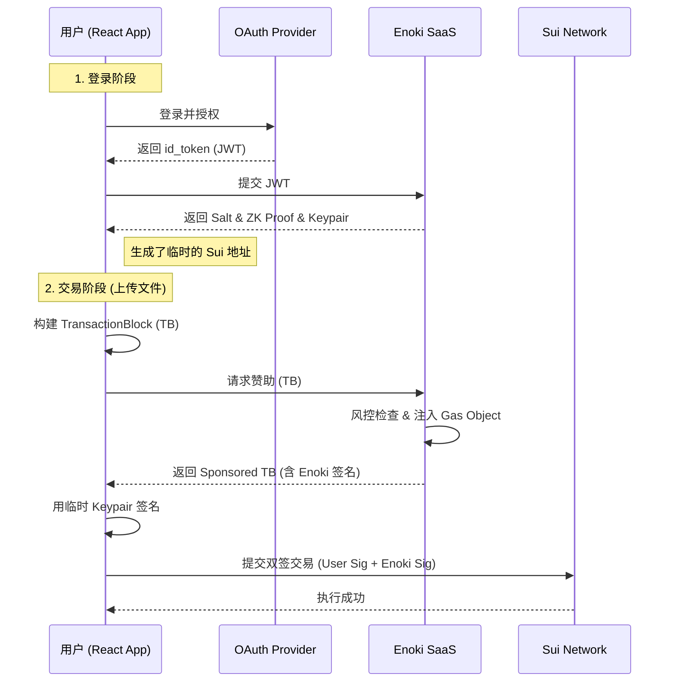

# Enoki (Sui zkLogin + Gas Station) 集成调研报告

**日期：** 2025-11-25
**服务商：** Mysten Labs (Sui 官方团队)
**核心功能：** 托管式 zkLogin、赞助交易 (Sponsored Transactions)
**适用场景：** 快速 MVP、无需自行搭建 Salt 服务器和证明服务的 Web3 应用。

-----

## 1\. 产品核心价值

Enoki 将复杂的底层 zkLogin 协议封装为 SaaS 服务，开发者无需维护基础设施即可获得以下能力：

1.  **无感账户体系 (Managed zkLogin)：**
      * 用户直接使用 Google/Twitch/Facebook 登录。
      * Enoki 托管了最复杂的 **Salt Server** (管理用户盐值) 和 **Proving Service** (生成零知识证明)。
      * **优势：** 开发集成只需几行代码，无需处理复杂的密码学逻辑。
2.  **内置 Gas Station (Sponsored Tx)：**
      * 提供开箱即用的 Gas 代付接口。
      * **优势：** 可以在控制台直接充值 SUI，并配置简单的限额策略，无需自建后端钱包池。

-----

## 2\. 集成流程详解 (Frontend Only)

与自研 Golang 后端不同，Enoki 的集成主要集中在前端 (React/TypeScript) 和 Enoki 控制台配置。

### 2.1 第一阶段：控制台配置

1.  **访问门户：** [Enoki Developer Portal](https://portal.enoki.mystenlabs.com/)
2.  **创建应用：** 获取 **Public API Key**。
3.  **配置 Auth Provider (以 Google 为例)：**
      * 在 Google Cloud Console 创建 OAuth 2.0 Client。
      * **关键设置：** 将 Enoki 提供的 Redirect URI (如 `https://<AppID>.auth.enoki.mystenlabs.com/auth/google/callback`) 填入 Google 后台。
4.  **配置 Gas Station：**
      * 在 Enoki 面板的 "Gas Station" 页面，存入少量的 SUI (Testnet/Mainnet)。
      * 设置 **Global Limit** (每日总额) 和 **Per User Limit** (单用户限额)。

### 2.2 第二阶段：项目代码集成

#### 安装依赖

```bash
npm install @mysten/enoki @mysten/sui.js
```

#### 初始化 Provider (`main.tsx`)

```tsx
import { EnokiFlowProvider } from '@mysten/enoki/react';

ReactDOM.createRoot(document.getElementById('root')!).render(
  <EnokiFlowProvider apiKey="YOUR_ENOKI_PUBLIC_KEY">
    <App />
  </EnokiFlowProvider>
);
```

#### 实现登录 (`LoginBtn.tsx`)

```tsx
import { useEnokiFlow } from '@mysten/enoki/react';

export const LoginBtn = () => {
  const flow = useEnokiFlow();

  const handleLogin = async () => {
    // 这一步会跳转到 Google 授权页
    window.location.href = await flow.createAuthorizationURL({
      provider: 'google',
      clientId: 'YOUR_GOOGLE_CLIENT_ID',
      redirectUrl: window.location.href, // 登录成功后跳回这里
      network: 'testnet',
    });
  };

  return <button onClick={handleLogin}>Google 登录</button>;
};
```

#### 实现免 Gas 交易 (`Mint.tsx`)

这是与 Walrus 交互的核心部分。

```tsx
import { useEnokiFlow } from '@mysten/enoki/react';
import { TransactionBlock } from '@mysten/sui.js/transactions';
import { useSuiClient } from '@mysten/dapp-kit'; // 或直接 new SuiClient

export const UploadAction = () => {
  const flow = useEnokiFlow();
  const client = useSuiClient();

  const handleUpload = async () => {
    // 1. 构建交易 (例如：将 Walrus Blob ID 注册到链上)
    const txb = new TransactionBlock();
    txb.moveCall({
      target: '0x...::walrus_store::register_blob',
      arguments: [txb.pure('blob_id_xyz')],
    });

    // 2. 请求 Enoki 赞助 (核心差异点)
    // Enoki 会自动注入 Gas Object 并由它的 Gas 钱包签名
    const sponsoredTx = await flow.sponsorTransaction({
      network: 'testnet',
      transactionBlock: txb,
      client,
    });

    // 3. 用户签名并执行
    // 获取当前登录用户的 Ephemeral Key
    const signer = await flow.getKeypair();
    
    const result = await client.signAndExecuteTransactionBlock({
      transactionBlock: sponsoredTx, // 注意：使用赞助后的 tx
      signer: signer,
      options: { showEffects: true },
    });

    console.log("Success:", result);
  };
};
```

-----

## 3\. 架构原理图



-----

## 4\. 优劣势分析

### 4.1 优势 (Pros)

1.  **极速落地：** 从零到跑通 Google 登录 + 免 Gas 交易，熟练开发者仅需 1 小时。
2.  **零基础设施：** 不需要搭建 Salt Server（这通常是最难的部分，需要高安全等级），不需要维护 Proving Service（计算密集型）。
3.  **官方背书：** 由 Mysten Labs 维护，与 Sui 节点的兼容性最好，API 更新最及时。
4.  **成本透明：** 在 MVP 阶段几乎免费，不需要预先购买大量服务器资源。

### 4.2 劣势 (Cons)

1.  **中心化依赖：** 用户的 Salt 存储在 Enoki 服务器上。如果 Enoki 停服，虽然资产还在链上，但用户无法通过 Google 账号计算出原来的地址（除非用户提前备份了 Salt）。
2.  **可迁移性挑战：** 也就是“Vendor Lock-in”。未来如果想迁移到自建的 zkLogin 服务，需要 Enoki 提供 Salt 的导出/迁移方案（需关注官方是否提供此接口）。
3.  **风控策略有限：** 相比于自研 Golang 后端可以写任意复杂的业务逻辑判断，Enoki 控制台目前仅提供基础的金额和次数限制。

-----

## 5\. 针对 Walrus 项目的建议

鉴于 Walrus 是一个去中心化存储协议，用户体验极其重要。

### 推荐实施路径

1.  **阶段一 (快速原型/测试网)：采用 Enoki**

      * **理由：** 团队可以将 100% 的精力集中在 Walrus 协议的对接和前端 UI 上，而不用在身份验证和 Gas 支付后端上浪费时间。
      * **操作：** 直接使用 `EnokiFlowProvider` 包裹应用，配置 Google 登录。

2.  **阶段二 (主网发布前)：评估风控需求**

      * 如果发现 Enoki 的基础限流无法满足需求（例如需要判断上传内容的大小、类型来决定是否赞助），则考虑**混合模式**：
          * **身份层**：继续使用 Enoki 的 zkLogin (因为它解决了 Salt 管理的难题)。
          * **赞助层**：切换到自研的 Golang Gas Station（如上一份报告所述），只接管 `sponsorTransaction` 这一步，此时 Enoki 仅作为登录工具使用。

3.  **阶段三 (完全去中心化 - 可选)：**

      * 如果项目体量极大，为了消除对 Mysten Labs SaaS 的依赖，再考虑自建 Salt Server 和 Prover。

### 结论

**Enoki 是目前最适合该项目的起步方案。** 它完美契合“Web2 用户无感使用 Walrus”的产品愿景。建议立即申请 API Key 并在测试网进行集成。