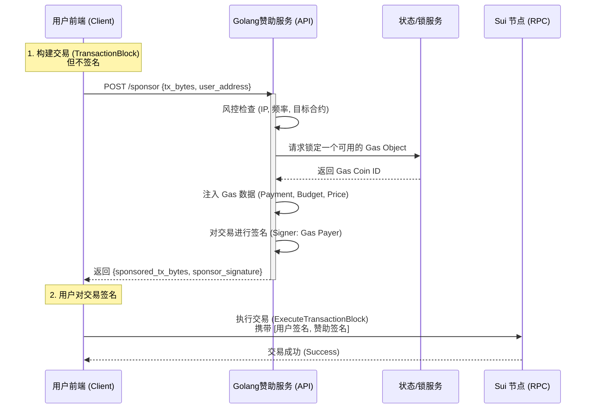

# Sui 网络赞助交易 (Gas Station) 实现调研报告

**日期：** 2025-11-25
**技术栈：** Golang (Backend) / TypeScript (Frontend) / Sui Move
**适用场景：** 降低用户门槛（如 Walrus 存储应用），实现 Web2 级别的无感交互。

-----

## 1\. 核心概念与价值

### 1.1 什么是赞助交易？

在 Sui 网络中，交易结构明确区分了 **发送者 (Sender)** 和 **Gas 支付者 (Gas Payer)**。

  * **传统交易：** Sender 和 Gas Payer 是同一个人。
  * **赞助交易：** 允许第三方（应用开发者）作为 Gas Payer，为 Sender 的交易支付 Gas 费。

### 1.2 核心价值

1.  **消除用户门槛：** 用户无需持有 SUI 代币即可与 DApp 交互（如上传文件到 Walrus）。
2.  **隐私保护：** 用户的新地址不需要为了 Gas 而从交易所转账，切断了资金链路关联。
3.  **灵活的商业模式：** 项目方可将 Gas 成本视为获客成本（CAC），或通过订阅制收费。

-----

## 2\. 系统架构设计

### 2.1 交互时序图

为了实现自研赞助服务，前后端的交互流程如下：



-----

## 3\. 技术实现方案

### 3.1 后端实现 (Golang)

推荐使用社区成熟 SDK：`github.com/block-vision/sui-go-sdk`

#### 核心数据结构

```go
// 响应结构体
type SponsorResponse struct {
    TxBytesBase64    string `json:"tx_bytes"`    // 已注入Gas并序列化的交易
    SponsorSignature string `json:"sponsor_sig"` // 你的后端签名
}
```

#### 关键逻辑流程

1.  **反序列化：** 接收前端传来的 `TxBytes` (BCS 编码)。
2.  **Coin 选取 (关键)：** 从本地维护的 Coin 池中取出一个未被占用的 SUI Object。
3.  **组装交易：**
      * 设置 `GasData.Owner` = 赞助钱包地址。
      * 设置 `GasData.Payment` = 选中的 Coin Object ID。
      * 设置 `GasData.Budget` = 预估费用 (如 5,000,000 MIST)。
      * 设置 `GasData.Price` = 当前网络费率 (Reference Gas Price)。
4.  **签名：** 使用后端私钥对修改后的交易字节进行签名。
5.  **返回：** 将新的字节流和签名返回给前端。

### 3.2 前端集成 (TypeScript/React)

前端不再直接 `signAndExecute`，而是分步处理：

```typescript
import { TransactionBlock } from '@mysten/sui.js/transactions';

// 1. 构建交易
const txb = new TransactionBlock();
txb.moveCall({ target: 'package::module::func', arguments: [...] });

// 2. 序列化 (不签名)
const txBytes = await txb.build({ client: suiClient, onlyTransactionKind: false });

// 3. 请求后端赞助
const res = await fetch('/api/sponsor', {
    method: 'POST',
    body: JSON.stringify({ tx_bytes: Buffer.from(txBytes).toString('base64') })
});
const { tx_bytes: sponsoredBytes, sponsor_sig } = await res.json();

// 4. 用户签名 & 提交双签交易
const sponsoredTxb = TransactionBlock.from(sponsoredBytes);
const { signature: userSig } = await wallet.signTransactionBlock({ transactionBlock: sponsoredTxb });

await client.executeTransactionBlock({
    transactionBlock: sponsoredBytes, 
    signature: [userSig, sponsor_sig], // 聚合签名
});
```

-----

## 4\. 关键技术难点与解决方案 (Risk & Challenges)

在生产环境中自研赞助服务，必须解决以下三个核心问题：

### 4.1 并发冲突 (Object Locking)

  * **问题：** Sui 的 Object 是有版本的。如果两个并发请求使用了同一个 Gas Coin，第一笔成功后，Coin 版本号变更，第二笔交易会因 `ObjectVersionMismatch` 失败。
  * **解决方案：**
      * **Coin Pool (硬币池)：** 后端维护一个 Golang `Channel` 或 Redis List，存放 50-100 个可用的 Coin ID。
      * **互斥锁：** 每次请求 `Pop` 一个 Coin，交易确认上链后（或超时后），再将该 Coin（或找零后的新 Coin）`Push` 回池子。

### 4.2 碎片整理 (Coin Management)

  * **问题：** 随着交易进行，大额 Coin 会不断被找零，或者变成太多小额 Coin（Dust），导致 Gas 不足或管理混乱。
  * **解决方案：**
      * **守护进程：** 编写一个后台 Goroutine，每隔几分钟扫描钱包。
      * **自动拆分/合并：** 如果可用 Coin 少于阈值，自动发起 `SplitCoins` 交易；如果小碎片太多，自动发起 `MergeCoins` 交易。

### 4.3 安全风控 (Security)

  * **问题：** 恶意用户可能利用你的接口免费刷毫无意义的交易，耗光你的 SUI。
  * **解决方案：**
      * **白名单机制：** 后端在签名通过 `bcs` 解析交易内容，检查 `MoveCall` 的 `target` 是否为你项目的合约地址（例如只允许调用 Walrus 存储合约）。
      * **限额策略：** 限制每个 User Address 每天只能获得 10 次赞助，或总金额不超过 1 SUI。

-----

## 5\. 方案对比：自研 (Golang) vs 托管 (Enoki)

| 维度 | 自研方案 (Golang Custom) | 托管方案 (Enoki / Shinami) |
| :--- | :--- | :--- |
| **开发成本** | 高 (需处理并发、Coin管理) | 低 (开箱即用) |
| **维护成本** | 中 (需监控 Gas 余额和服务状态) | 低 (SaaS 模式) |
| **使用费用** | **极低** (仅支付实际 Gas) | **高** (Gas费 + 服务溢价/月费) |
| **可控性** | 极高 (由于风控逻辑完全自定义) | 中 (受限于平台提供的策略) |
| **适用阶段** | 长期运营、高频交易项目 | 原型验证、早期初创项目 |

-----

## 6\. 结论与建议

针对我们要开发的 Walrus 存储类应用：

1.  **短期/MVP 阶段：** 建议使用 **Enoki**。它与 zkLogin 结合紧密，能快速跑通“Google 登录 -\> 免 Gas 上传”的流程，验证产品逻辑。
2.  **长期/正式上线：** 建议切换到 **Golang 自研赞助服务**。
      * **理由 1：** 存储类应用交互可能较高频，自研能大幅节省成本。
      * **理由 2：** 可以针对 Walrus 的特定操作（如 Blob ID 登记）做精细化的风控，防止滥用。
      * **理由 3：** Golang 的并发处理能力非常适合管理 Gas Coin Pool。

### 下一步行动建议

  * [ ] **后端：** 搭建基础 Golang 服务，引入 `sui-go-sdk`，打通“接收 Bytes -\> 签名 -\> 返回”的基础链路。
  * [ ] **后端：** 设计基于 Redis 的 Coin 锁定机制。
  * [ ] **前端：** 封装通用的 `sponsorAndExecute` 方法，统一处理赞助逻辑。